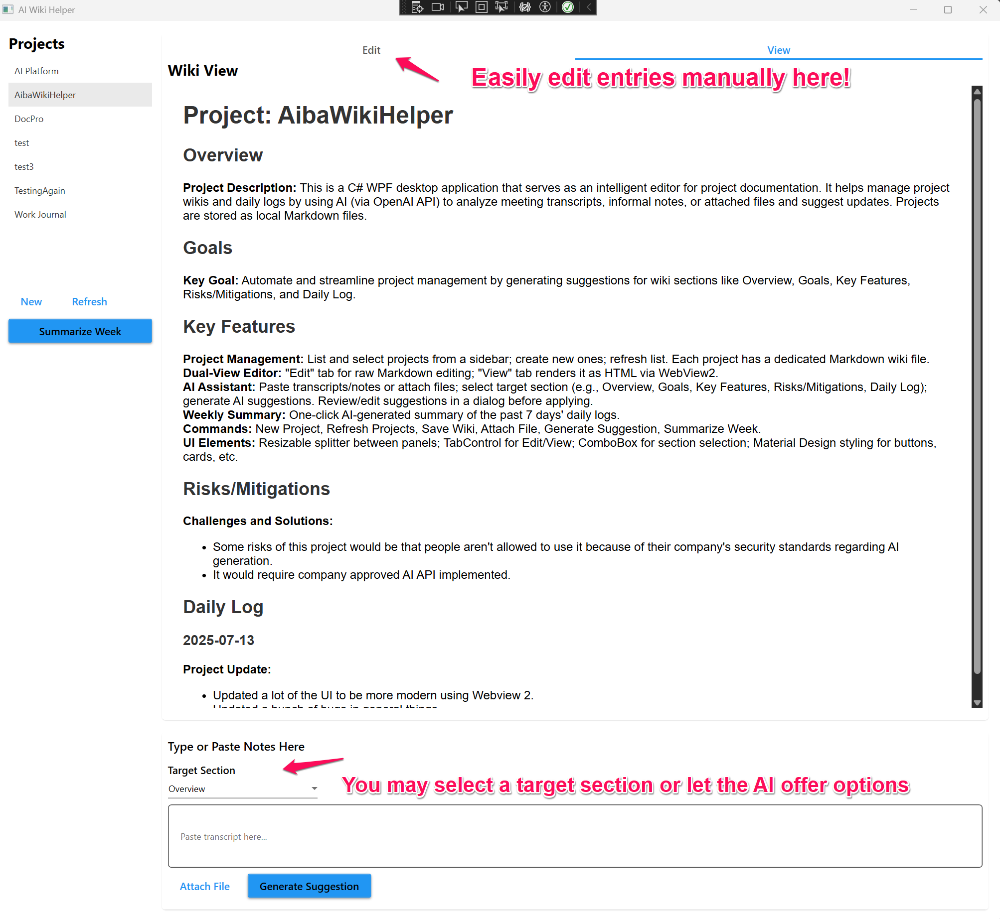

# AI Project Wiki Helper

A C# desktop application that acts as an intelligent editor for project documentation. The application uses the OpenAI API to analyze meeting transcripts or informal notes and suggests updates to a project's wiki or its daily log.

## Features

-   **Manage Projects:** Create and manage multiple project wikis, each stored as a local Markdown file.
-   **Dual View Editor:** View the rendered Markdown for easy reading or edit the raw source directly.
-   **Flexible Input:** Paste text directly into the AI Assistant or attach transcript files (`.txt`, `.vtt`, `.docx`).
-   **AI-Powered Suggestions:**
    -   Generate a new, formatted **Daily Log** entry from informal notes.
    -   Suggest complete rewrites of major wiki sections (`Overview`, `Goals`, etc.) based on new information.
-   **Editable Suggestions:** Review and edit the AI's suggestions in a dialog before applying them.
-   **Weekly Summary:** Get a one-click, AI-generated summary of all daily log activities from the past 7 days.

## Setup

1.  **Prerequisites:** Visual Studio 2022 with the **.NET desktop development** workload installed.
2.  **Clone:** Clone this repository to your local machine.
3.  **Open:** Open the `AIWikiHelper.sln` file in Visual Studio.
4.  **Configure API Key:**
    -   In the project folder, find `appsettings.template.json`.
    -   Create a copy of this file and rename it to `appsettings.json`.
    -   Open `appsettings.json` and replace `"YOUR_API_KEY_GOES_HERE"` with your valid OpenAI API key.
5.  **Run:** Press `F5` or click the Start button to build and run the application.

## How to Use

1.  Launch the application.
2.  Click "New Project" to create a new wiki file, or select an existing project from the list.
3.  Paste notes or a meeting transcript into the "AI Assistant" text box at the bottom.
4.  Select the section of the wiki you want the AI to update from the "Target Section" dropdown.
5.  Click "Generate Suggestion".
6.  Review and edit the suggestion in the pop-up dialog, then click "Apply" to save it to your wiki.